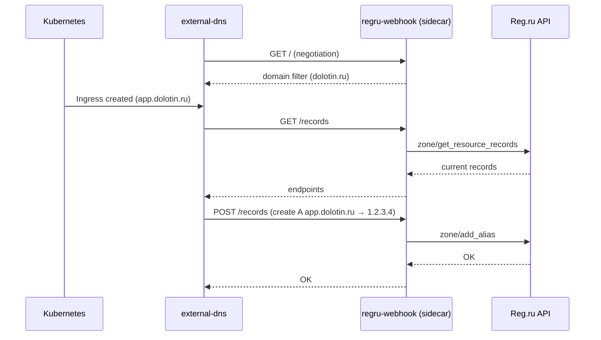

# external-dns-regru-webhook

[ExternalDNS](https://github.com/kubernetes-sigs/external-dns) webhook provider for [Reg.ru](https://www.reg.ru/) DNS API v2.

Runs as a sidecar alongside external-dns, implementing the standard [webhook provider protocol](https://kubernetes-sigs.github.io/external-dns/latest/tutorials/webhook-provider/).

## How it works



## Installation

```yaml
# values.yaml for external-dns Helm chart
provider:
  name: webhook
  webhook:
    image:
      repository: ghcr.io/aleks-dolotin/external-dns-regru-webhook
      tag: latest
    env:
      - name: REGU_USERNAME
        valueFrom:
          secretKeyRef:
            name: regru-credentials
            key: username
      - name: REGU_PASSWORD
        valueFrom:
          secretKeyRef:
            name: regru-credentials
            key: password
      - name: DOMAIN_FILTER
        value: "dolotin.ru"
```

## Environment variables

| Variable | Required | Description |
|---|---|---|
| `REGU_USERNAME` | Yes | Reg.ru API username |
| `REGU_PASSWORD` | Yes | Reg.ru API password |
| `DOMAIN_FILTER` | Yes | Comma-separated list of zones |
| `WEBHOOK_PORT` | No | HTTP port (default: 8888) |

## API endpoints

Standard external-dns webhook protocol on port 8888:

| Method | Path | Description |
|---|---|---|
| GET | `/` | Negotiation — returns domain filter |
| GET | `/records` | List all DNS records |
| POST | `/records` | Apply changes (create/update/delete) |
| POST | `/adjustendpoints` | Adjust endpoints (no-op) |

Content-Type: `application/external.dns.webhook+json;version=1`

## Reg.ru API

Uses client-accessible Reg.ru API v2 endpoints:

| Operation | Endpoint |
|---|---|
| List records | `zone/get_resource_records` |
| Create A | `zone/add_alias` |
| Create AAAA | `zone/add_aaaa` |
| Create CNAME | `zone/add_cname` |
| Create TXT | `zone/add_txt` |
| Delete | `zone/remove_record` |
| Update | remove + add |

## Development

```bash
make build       # build binary
make test        # unit tests
make test-race   # tests with race detector
make check       # full check (vet + test + test-race)

# Smoke tests (real Reg.ru API)
REGU_USERNAME=user REGU_PASSWORD=pass SMOKE_TEST_ZONE=dolotin.ru \
  make test-smoke
```

## Docker

```bash
make docker-build
make docker-push
```

## License

MIT
